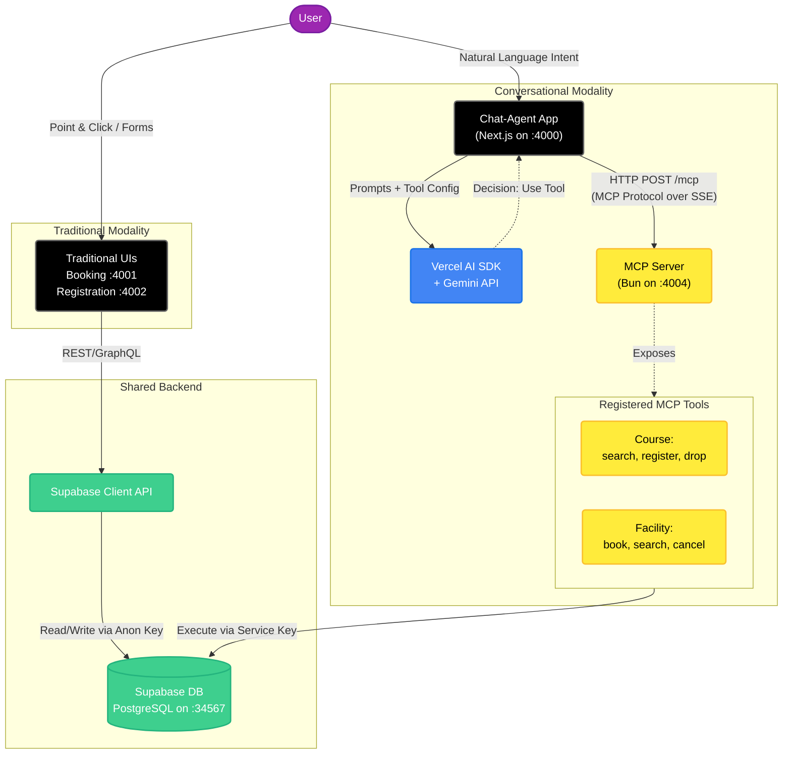
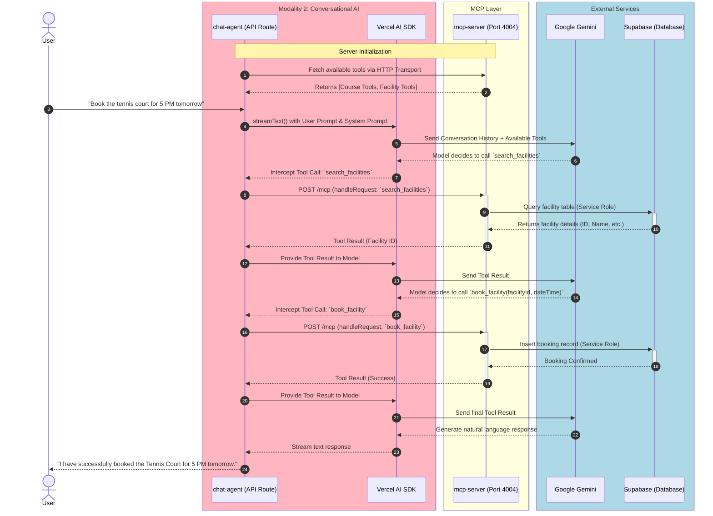

# MCP Architecture Setup

This document provides a detailed overview and diagrams of the Model Context Protocol (MCP) architecture setup in the `mcp-pj` experimental project.

## High-Level System Architecture

The overarching architecture is designed to compare traditional UI interactions with conversational (MCP-enabled) interactions. Both interaction pathways share the same underlying Supabase database to ensure a controlled experimental environment.

## MCP Interaction Sequence Diagram

When a user interacts with the `chat-agent`, the agent uses the Vercel AI SDK to communicate with the Google Gemini model. The model is made aware of the tools exposed by the `mcp-server` over HTTP transport.

## Detailed System Component Breakdown

1. **`chat-agent` (Next.js App on Port 4000):**
   - Implements `POST /api/chat`.
   - Uses `@ai-sdk/mcp`'s `createMCPClient` using `http` transport to dynamically pull all tool capabilities from `mcp-server`.
   - Maintains a secure session and proxies the AI's tool execution requests explicitly to the `mcp-server`.
   - Injects user UUID into standard prompt configurations, enforcing that Gemini refers to users securely and logically invokes MCP tools.

2. **`mcp-server` (Bun HTTP Server on Port 4004):**
   - Built with Bun and `@modelcontextprotocol/sdk`.
   - Exposes tools grouped into logical endpoints (Courses, Facilities).
   - Validates requests via `MCP_AUTH_TOKEN`.
   - Directly executes database mutations utilizing the Supabase **Service Role Key** which enables backend security independently of the client APIs.

3. **Traditional UIs (Next.js Apps on Ports 4001, 4002):**
   - Represents the baseline for evaluating intent-driven conversational interfaces against traditional point-and-click or form-based interactions.
   - Connects to Supabase via standard client APIs.

4. **Supabase Integration (Port 34567):**
   - Instead of routing complex business logic throughout various backend wrappers, `mcp-server` hits Supabase Postgres tables directly.
   - Operations from conversational interfaces execute robustly under a simplified authorization context while preserving the shared source of truth.
   - Traditional UIs operate over standard Supabase client libraries (REST/GraphQL endpoints) with anonymous/user keys.
